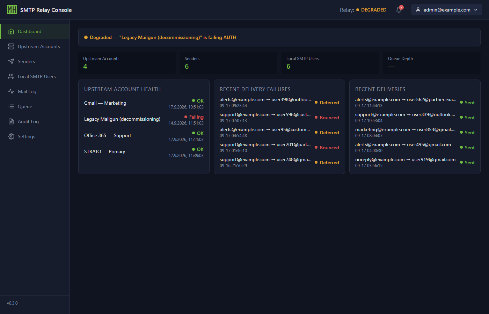
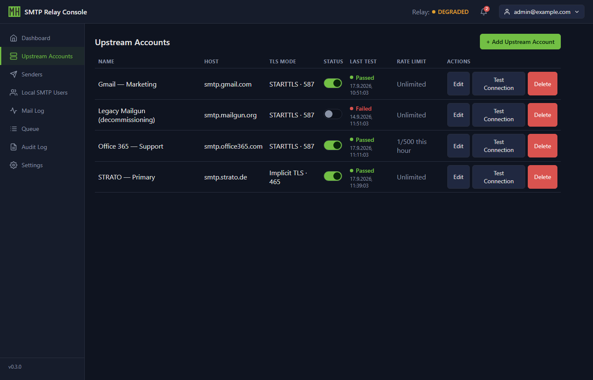
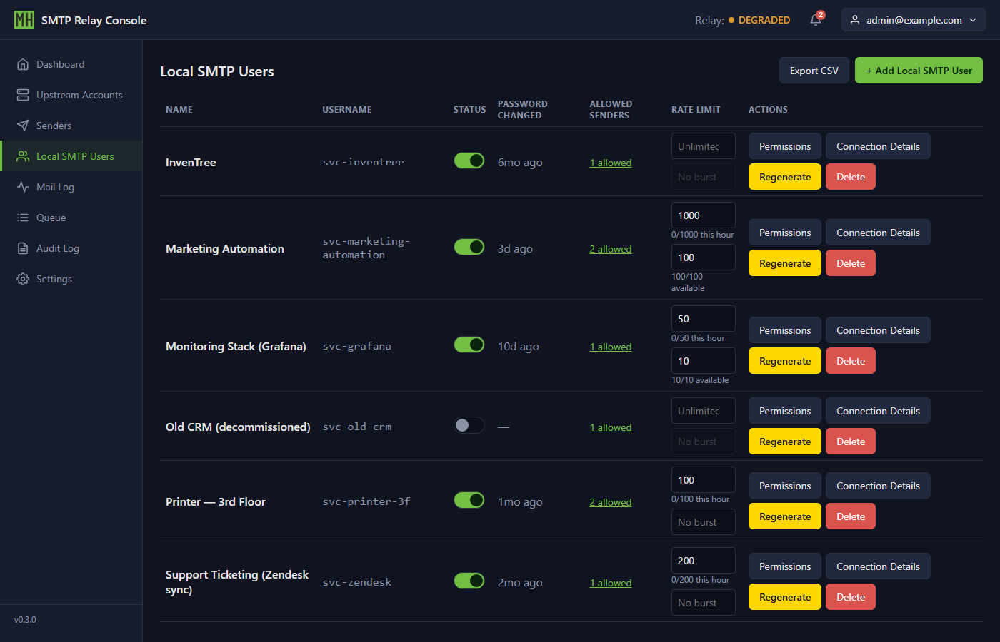
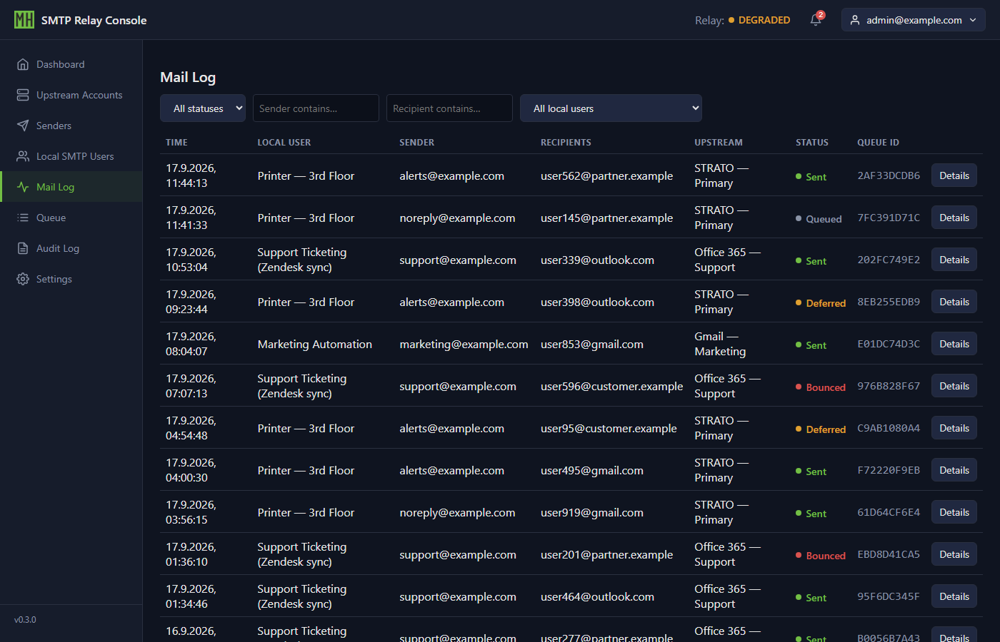
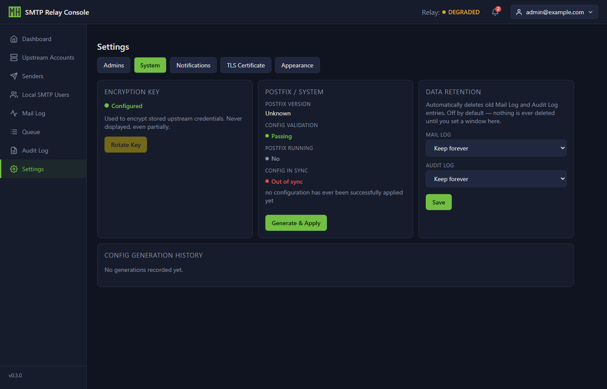
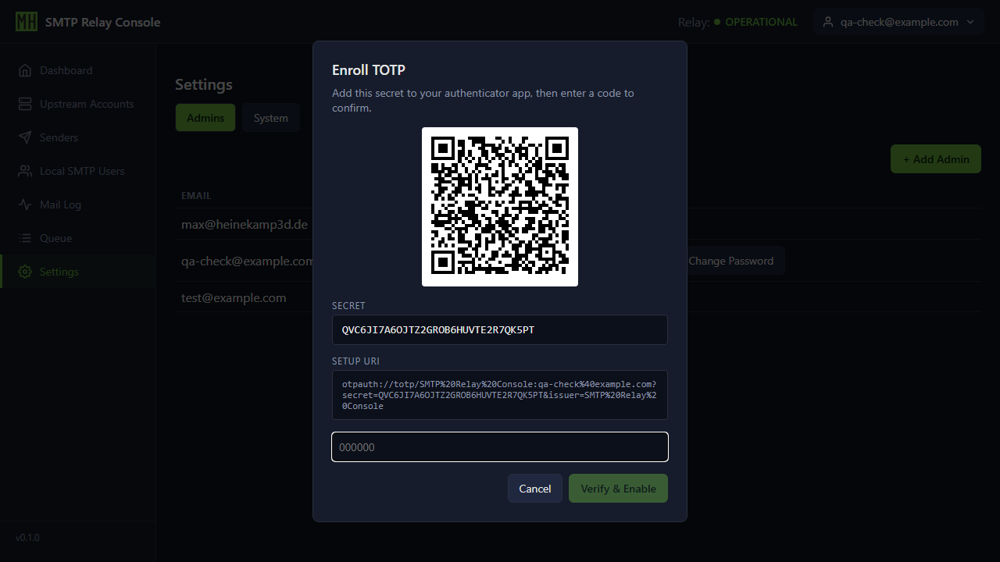
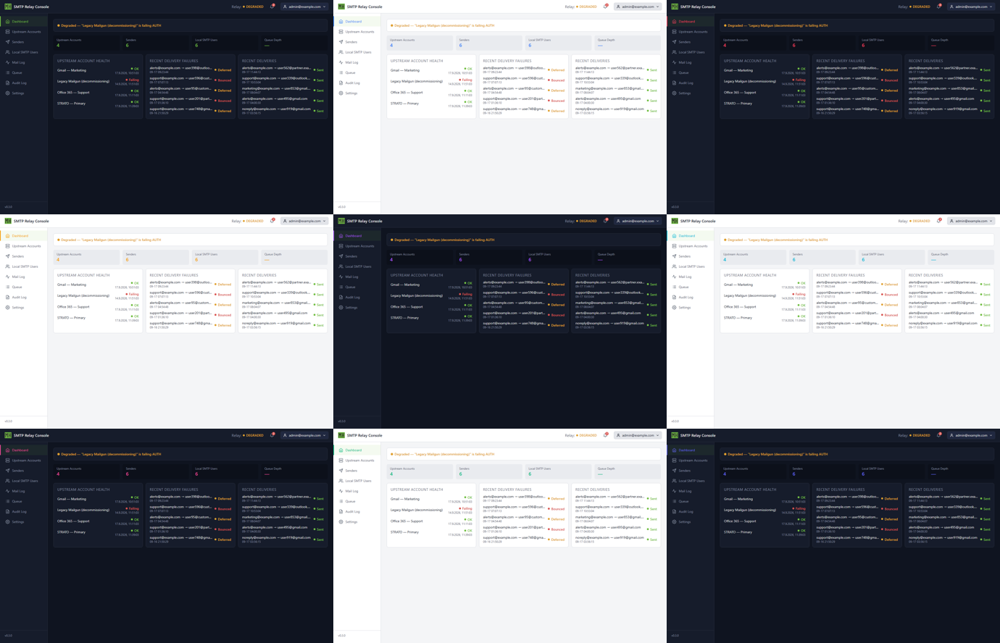

# SMTP Manager

[](https://github.com/Heinekamp/SMTP-Manager/actions/workflows/ci.yml)
[](https://github.com/Heinekamp/SMTP-Manager/releases)

A self-hosted management plane around Postfix. It lets a small number of
externally-hosted SMTP mailboxes (a STRATO account, Gmail, etc.) be shared by
many internal services — a printer, a monitoring stack, InvenTree, whatever
needs to send mail — **without ever handing those services the real upstream
credentials**.

```text
Internal services ──▶ Managed SMTP Relay ──▶ External SMTP provider(s)
                       (Web UI, API, Postfix)
```

Each internal service gets its own local SMTP credential, scoped to send only
as specific, admin-approved sender addresses. Revoking one service's access
never touches the shared upstream account, and the upstream password is never
visible to anything but this relay.

## Features

- **Centralized upstream credentials** — store SMTP provider accounts once,
  encrypted at rest (AES-256-GCM), never exposed in any API response.
- **Per-service local credentials** — issue a unique SMTP username/password
  per internal service, each restricted to a set of admin-approved sender
  addresses (enforced by Postfix's own `sender_dependent_relayhost_maps` /
  `smtpd_sender_login_maps`, not just application-layer trust).
- **Sending rate limits** — an optional per-hour ceiling and burst-bucket
  smoothing for local users, plus per-account outbound pacing for upstream
  accounts. A local user stuck in an unbroken run of rejections always
  surfaces on the notification bell, with an opt-in alert email and an
  opt-in automatic disable for a genuinely runaway sender.
- **Automatic TLS via Let's Encrypt** — DNS-01 issuance and renewal
  (Cloudflare) for the submission port, replacing the default self-signed
  placeholder certificate. No inbound port 80/443 needed.
- **Alerting & monitoring** — an in-app notification bell plus optional
  email alerts for relay degradation, failing upstream accounts, rate-limit
  abuse, and available app/Postfix updates, backed by scheduled connection
  testing and a background update checker.
- **A real admin console** — dashboard, a searchable/paginated mail log,
  live Postfix queue management, a full audit log, read-only CSV export,
  and config generation history, all backed by a REST API.
- **Visual customization** — light/dark/system theme (a personal,
  per-browser preference), plus an admin-configurable accent color, custom
  logo, and matching favicon for the whole deployment.
- **Security-conscious by default** — TOTP two-factor login (with QR
  enrollment) and session-based auth with CSRF protection, Argon2id
  password hashing, rate-limited login attempts, admin
  deactivation/reactivation, break-glass CLI recovery for a forgotten
  password or lost authenticator, and a full audit log of every
  administrative action.
- **Configurable data retention** — Mail Log and Audit Log can auto-delete
  rows past a chosen age; off by default.
- **Self-contained deployment** — two Docker Compose services (`app` +
  `postfix`), SQLite by default (swappable for Postgres), health checks, and
  a tested backup/restore procedure.
- **CLI for the essentials** — bootstrap an admin, recover a locked-out
  account, rotate the encryption key, regenerate config, or inspect the
  queue without needing the web UI.

## Screenshots

Light mode and a custom accent color are both admin-configurable (Settings →
Appearance) — every screen below still works in light mode too.

| Dashboard | Upstream Accounts |
|---|---|
|  |  |

| Local SMTP Users | Mail Log |
|---|---|
|  |  |

| Settings — System | TOTP enrollment |
|---|---|
|  |  |

| Theming & accent colors |
|---|
|  |

## Quick start

```bash
git clone https://github.com/Heinekamp/SMTP-Manager.git
cd SMTP-Manager
cp .env.example .env
docker compose run --rm app relay generate-encryption-key   # paste the output into .env
docker compose up -d --build
```

Then open `http://<host>:8000/` to create the first admin account. See
[docs/installation.md](docs/installation.md) for the full walkthrough
(TLS, exposed ports, first-run setup).

## Documentation

- [Installation](docs/installation.md)
- [Configuration reference](docs/configuration.md)
- [Backup & restore](docs/backup-restore.md)
- [Troubleshooting](docs/troubleshooting.md)
- [Upgrading](docs/upgrading.md)
- [Architecture](docs/architecture.md)
- [Security model](docs/security-model.md)
- [Database schema](docs/database-schema.md)

## License

Not yet decided — no `LICENSE` file exists in this repository yet. Treat
this as "all rights reserved" until one is added.
